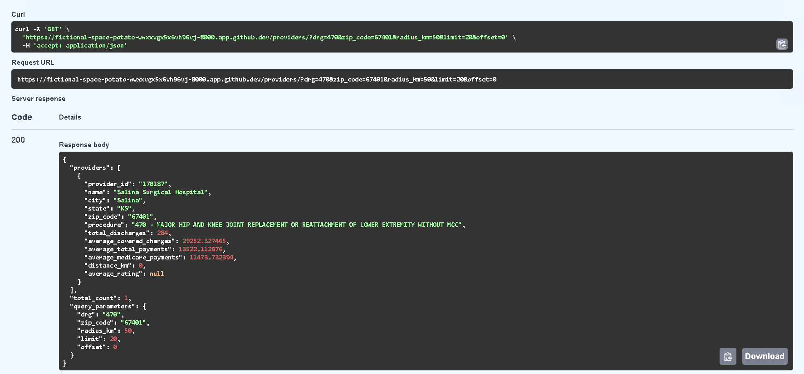

# Healthcare Cost Navigator MVP

A web service that enables patients to search for hospitals offering MS-DRG procedures, view estimated prices & quality ratings, and interact with an AI assistant for natural language queries.

## Features

- **Hospital Search**: Search hospitals by MS-DRG procedures, ZIP code, and radius
- **Cost Comparison**: View and compare hospital pricing for procedures
- **Quality Ratings**: Mock star ratings (1-10 scale) for hospital quality assessment
- **AI Assistant**: Natural language interface for healthcare queries
- **RESTful API**: Clean JSON API with comprehensive documentation

## Tech Stack

- **Backend**: Python 3.11+, FastAPI, async SQLAlchemy
- **Database**: PostgreSQL with async support
- **AI**: OpenAI GPT-3.5-turbo for natural language processing
- **Infrastructure**: Docker Compose, Alembic for migrations
- **Package Management**: Poetry

## Quick Start

### Prerequisites

- Docker and Docker Compose
- OpenAI API key
- Git

### 1. Clone Repository

```bash
git clone https://github.com/beaubeas/healthcare-cost-navigator.git
cd healthcare-cost-navigator
```

### 2. Environment Setup

```bash
# Copy environment template
cp .env.example .env

# Edit .env file and add your OpenAI API key
# OPENAI_API_KEY=your_actual_api_key_here
```

### 3. Start Services

```bash
# Start PostgreSQL and API services
docker-compose up -d

# Check services are running
docker-compose ps
```

### 4. Load Sample Data

```bash
# Run ETL script to load hospital data and generate ratings
docker-compose exec api python etl.py
```

### 5. Test the API

```bash
# Health check
curl http://localhost:8000/health

# Search providers
curl "http://localhost:8000/providers?drg=470&zip_code=67401&radius_km=40"

# Ask AI assistant
curl -X POST http://localhost:8000/ask \
  -H "Content-Type: application/json" \
  -d '{"question": "Who is cheapest for knee replacement near 67401?"}'
```

## API Endpoints

### GET /providers

Search hospitals by DRG, ZIP code, and radius.

**Parameters:**
- `drg` (optional): DRG code or procedure name
- `zip_code` (optional): ZIP code for location search
- `radius_km` (optional): Search radius in kilometers (default: 50)
- `limit` (optional): Max results (default: 20)
- `offset` (optional): Pagination offset (default: 0)

**Example:**
```bash
curl "http://localhost:8000/providers?drg=470&zip_code=67401&radius_km=25&limit=10"
```

### POST /ask

Natural language interface for healthcare queries.

**Body:**
```json
{
  "question": "Who is cheapest for DRG 470 within 25 miles of 67401?"
}
```

**Example:**
```bash
curl -X POST http://localhost:8000/ask \
  -H "Content-Type: application/json" \
  -d '{"question": "Which hospitals have the best ratings for heart surgery near 10032?"}'
```

### GET /ask/examples

Get example questions the AI can answer.

```bash
curl http://localhost:8000/ask/examples
```

## Sample cURL Commands

### 1. Search by DRG and Location
```bash
curl "http://localhost:8000/providers?drg=470&zip_code=67401&radius_km=40"
```

### 2. Search by Procedure Name
```bash
curl "http://localhost:8000/providers?drg=knee%20replacement&zip_code=25301&radius_km=25"
```

### 3. Get Specific Provider
```bash
curl "http://localhost:8000/providers/330125"
```

### 4. AI Cost Query
```bash
curl -X POST http://localhost:8000/ask \
  -H "Content-Type: application/json" \
  -d '{"question": "What is the cheapest hospital for major joint replacement near 67401?"}'
```

### 5. AI Quality Query
```bash
curl -X POST http://localhost:8000/ask \
  -H "Content-Type: application/json" \
  -d '{"question": "Which hospitals have the best ratings for cardiac procedures near 10016?"}'
```

### 6. AI General Search
```bash
curl -X POST http://localhost:8000/ask \
  -H "Content-Type: application/json" \
  -d '{"question": "Show me hospitals that do pneumonia treatment in Brooklyn"}'
```

### 7. Out-of-Scope Query (Will be declined)
```bash
curl -X POST http://localhost:8000/ask \
  -H "Content-Type: application/json" \
  -d '{"question": "What is the weather today?"}'
```

## AI Assistant Example Prompts

The AI assistant can handle various types of healthcare-related queries:

### Cost-Related Queries
1. "Who is cheapest for DRG 470 within 25 miles of 10001?"
2. "What's the most affordable hospital for knee replacement near 10032?"
3. "Show me low-cost options for heart surgery within 40 miles of 11201"
4. "Find the cheapest pneumonia treatment near 10075"
5. "What are the most affordable hospitals for joint replacement in New York?"

### Quality-Related Queries
1. "Which hospitals have the best ratings for heart surgery near 10032?"
2. "Show me top-rated hospitals for joint replacement in New York"
3. "What are the highest quality hospitals for cardiac procedures near 10016?"
4. "Find hospitals with good ratings for pneumonia treatment in Brooklyn"
5. "Which hospital has the best quality ratings for DRG 194?"

### General Search Queries
1. "Find hospitals that do pneumonia treatment near 10075"
2. "Show me all hospitals offering DRG 194 within 30 miles of 11215"
3. "What hospitals in Brooklyn do major joint replacement?"

## Database Schema

### Providers Table
- `provider_id`: Unique CMS provider identifier
- `provider_name`: Hospital name
- `provider_city/state/zip_code`: Location information
- `ms_drg_definition`: Medical procedure definition
- `total_discharges`: Volume indicator
- `average_covered_charges`: Average hospital bill
- `average_total_payments`: Total amount paid
- `average_medicare_payments`: Medicare portion

### Ratings Table
- `provider_id`: Foreign key to providers
- `rating`: Star rating (1-10 scale)
- `rating_type`: Type of rating (overall, quality, safety, etc.)

## Development Setup

### Local Development (without Docker)

1. **Install Dependencies**
```bash
poetry install
```

2. **Start PostgreSQL**
```bash
# Using Docker for just the database
docker run -d \
  --name postgres \
  -e POSTGRES_DB=healthcare_navigator \
  -e POSTGRES_USER=postgres \
  -e POSTGRES_PASSWORD=postgres \
  -p 5432:5432 \
  postgres:15
```

3. **Run Migrations**
```bash
alembic upgrade head
```

4. **Load Data**
```bash
python etl.py
```

5. **Start API**
```bash
uvicorn app.main:app --reload
```

### Database Migrations

```bash
# Create new migration
alembic revision --autogenerate -m "Description"

# Apply migrations
alembic upgrade head

# Rollback migration
alembic downgrade -1
```

## Architecture Decisions

### 1. **Async Architecture**
- Used async SQLAlchemy and FastAPI for better performance
- Enables handling multiple concurrent requests efficiently
- Non-blocking database operations

### 2. **Service Layer Pattern**
- Separated business logic into service classes
- `ProviderService` handles hospital search and filtering
- `AIService` manages natural language processing
- Improves testability and maintainability

### 3. **AI Integration Strategy**
- OpenAI for natural language understanding and response generation
- Fallback regex parsing when AI fails
- Structured parameter extraction from natural language
- Grounded responses based on actual database results

### 4. **Database Design**
- Composite indexes for common query patterns (DRG + ZIP)
- Separate ratings table for flexibility
- Foreign key relationships for data integrity

### 5. **Geographic Search**
- Geopy for ZIP code to coordinate conversion
- Geodesic distance calculation for accurate radius filtering
- Graceful fallback when geocoding fails

## Trade-offs

### 1. **Geocoding Performance**
- **Trade-off**: Real-time geocoding vs. pre-computed coordinates
- **Decision**: Real-time geocoding for simplicity
- **Impact**: Slower response times but more flexible
- **Alternative**: Pre-compute and cache coordinates for better performance

### 2. **AI Response Time**
- **Trade-off**: AI quality vs. response speed
- **Decision**: Use GPT-3.5-turbo with fallback logic
- **Impact**: ~1-2 second response times
- **Alternative**: Use faster models or pre-computed responses

### 3. **Data Freshness**
- **Trade-off**: Real-time data vs. batch processing
- **Decision**: Batch ETL process for sample data
- **Impact**: Data may be stale but system is simpler
- **Alternative**: Real-time data ingestion pipeline

### 4. **Search Complexity**
- **Trade-off**: Simple ILIKE search vs. full-text search
- **Decision**: ILIKE with fuzzy matching fallback
- **Impact**: Good enough for MVP, may need enhancement
- **Alternative**: PostgreSQL full-text search or Elasticsearch

## Testing



### Automated Test Suite

The project includes a comprehensive test suite with 45+ tests covering all major components:

#### Test Structure

```
tests/
├── __init__.py                 # Test package initialization
├── conftest.py                # Pytest fixtures and configuration
├── test_main.py               # Tests for main FastAPI application
├── test_providers_api.py      # Tests for providers API endpoints
├── test_assistant_api.py      # Tests for AI assistant API endpoints
├── test_provider_service.py   # Tests for provider service logic
├── test_models.py             # Tests for database models
└── README.md                  # Test documentation
```

#### Running Tests

**Basic Test Execution:**
```bash
# Run all tests
pytest

# Run tests with verbose output
pytest -v

# Run specific test file
pytest tests/test_main.py

# Run specific test function
pytest tests/test_main.py::TestMainApp::test_root_endpoint

# Run tests matching a pattern
pytest -k "test_provider"
```

**Using the Test Runner Script:**
```bash
# Run all tests
python run_tests.py

# Run with coverage report
python run_tests.py --coverage

# Run verbose tests
python run_tests.py --verbose

# Run specific test file
python run_tests.py --file test_main.py

# Run specific test function
python run_tests.py --test test_root_endpoint

# Run only fast tests (exclude slow tests)
python run_tests.py --fast
```

**Coverage Reports:**
```bash
# Generate HTML and terminal coverage reports
pytest --cov=app --cov-report=html --cov-report=term

# Or use the test runner
python run_tests.py --coverage
```

The HTML coverage report will be generated in `htmlcov/index.html`.

#### Test Categories

**Unit Tests:**
- **Models**: Test database model functionality
- **Services**: Test business logic in service classes
- **Utilities**: Test helper functions and utilities

**Integration Tests:**
- **API Endpoints**: Test FastAPI endpoints with database integration
- **Database Operations**: Test complex database queries and transactions

#### Test Features

- **Async Testing**: Full support for async/await patterns using pytest-asyncio
- **Database Testing**: In-memory SQLite database with proper fixtures and cleanup
- **API Testing**: HTTP client testing with dependency injection override
- **Mocking**: Proper mocking for external services (AI, geocoding)
- **Fixtures**: Reusable test data (sample providers, ratings)
- **Coverage Support**: Integration with pytest-cov for coverage reporting

#### Test Database

Tests use an in-memory SQLite database that is:
- Created fresh for each test session
- Automatically cleaned up after each test
- Isolated between tests to prevent interference

#### Writing New Tests

1. **Use descriptive test names**: `test_search_providers_with_valid_drg`
2. **Follow AAA pattern**: Arrange, Act, Assert
3. **Use appropriate fixtures**: Leverage existing fixtures for common setup
4. **Mock external dependencies**: Don't make real API calls in tests
5. **Test edge cases**: Include tests for error conditions and boundary values

#### Performance Testing

```bash
# Time test execution
pytest --durations=10

# Profile slow tests
pytest --durations=0
```

#### Troubleshooting

**Common Issues:**
1. **Import Errors**: Make sure you're running tests from the project root
2. **Database Errors**: Check that all required models are imported in conftest.py
3. **Async Issues**: Ensure async tests are marked with `@pytest.mark.asyncio`
4. **Fixture Errors**: Verify fixture dependencies are correctly defined

**Debug Mode:**
```bash
# Show full traceback
pytest --tb=long

# Stop on first failure
pytest -x

# Show local variables in traceback
pytest --tb=long --showlocals
```

### Manual Testing
```bash
# Start services
docker-compose up -d

# Test health endpoint
curl http://localhost:8000/health

# Test provider search
curl "http://localhost:8000/providers?drg=470&zip_code=10001"

# Test AI assistant
curl -X POST http://localhost:8000/ask \
  -H "Content-Type: application/json" \
  -d '{"question": "Who is cheapest for knee replacement near 10001?"}'
```

### API Documentation
Visit `http://localhost:8000/docs` for interactive API documentation.

## Production Considerations

### Security
- Add API authentication/authorization
- Rate limiting for AI endpoints
- Input validation and sanitization
- HTTPS termination

### Performance
- Database connection pooling
- Caching for frequent queries
- CDN for static assets
- Load balancing

### Monitoring
- Application metrics
- Database performance monitoring
- AI usage tracking
- Error logging and alerting

### Scalability
- Horizontal scaling with load balancers
- Database read replicas
- Async task queues for heavy operations
- Microservices architecture

## License

MIT License - see LICENSE file for details.

## Contributing

1. Fork the repository
2. Create a feature branch
3. Make your changes
4. Add tests
5. Submit a pull request